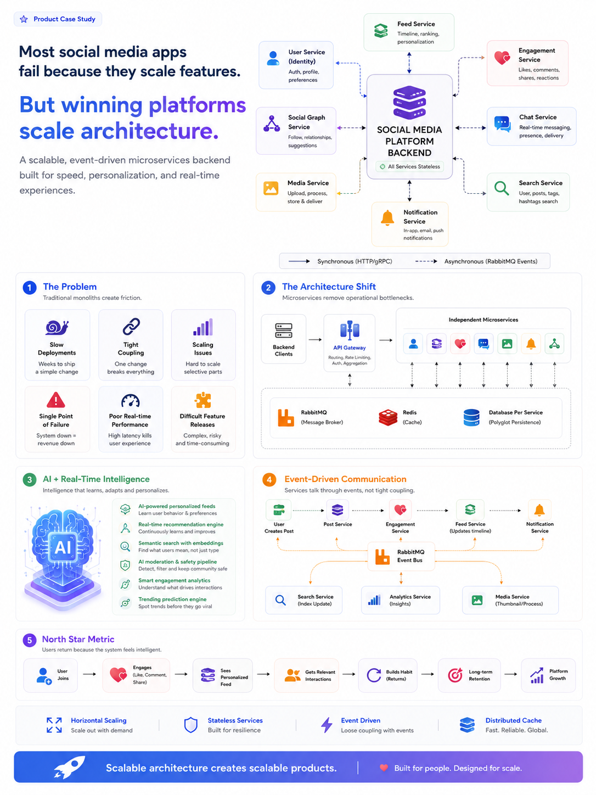

# 🚀 Social Media Microservice Platform

A scalable backend architecture built using modern microservices principles, event-driven communication, and real-time systems.

---

# 🏗️ System Architecture

<p align="center">
  
</p>

---

# ✨ Features

- Microservices Architecture
- API Gateway
- RabbitMQ Event-Driven Communication
- Real-time Chat System
- Feed Generation Service
- Search Service
- Notification System
- AI-powered Recommendations
- Scalable & Stateless Services
- Distributed Infrastructure

---

# ⚡ Core Services

## API Gateway
Handles:
- Authentication
- Routing
- Rate Limiting
- Load Balancing

---

## Identity Service
Handles:
- User Authentication
- JWT Management
- User Profiles

---

## Feed Service
Handles:
- Personalized Feed Generation
- Timeline Ranking
- Feed Updates

---

## Chat Service
Handles:
- Real-time Messaging
- Presence Tracking
- WebSocket Communication

---

## Engagement Service
Handles:
- Likes
- Comments
- Shares
- Reactions

---

## Post Service
Handles:
- Post Creation
- Post Management
- Content Metadata

---

## Media Service
Handles:
- Media Uploads
- Image Processing
- Storage Management

---

## Search Service
Handles:
- User Search
- Post Search
- Hashtag Search

---

## Notification Service
Handles:
- Real-time Notifications
- Push Events
- Event Consumption

---

## Social Service
Handles:
- Follow/Unfollow
- Social Graph
- User Relationships

---

# 🧠 Architecture Highlights

- Event-Driven Architecture
- Fault Isolation
- Independent Deployments
- Horizontal Scalability
- Distributed Caching
- Low Latency Communication
- Real-time Event Processing

---

# 🔄 Communication Flow

```text
Client
   ↓
API Gateway
   ↓
Microservices
   ↓
RabbitMQ Event Bus
   ↓
Notifications / Feed Updates / Search Indexing
```

---

# 📦 Shared Infrastructure

- RabbitMQ
- Redis
- Elasticsearch
- Object Storage
- Monitoring & Logging

---

# 🎯 Goals

- High Scalability
- Real-time Performance
- Clean Service Separation
- Production-grade Architecture
- AI-ready Backend Design

---

# 🚀 Future Improvements

- AI Recommendation Engine
- Semantic Search
- AI Moderation
- Analytics Pipeline
- Kubernetes Deployment
- CI/CD Automation

---

# 👨‍💻 Author

Raunak Kumar Jha
